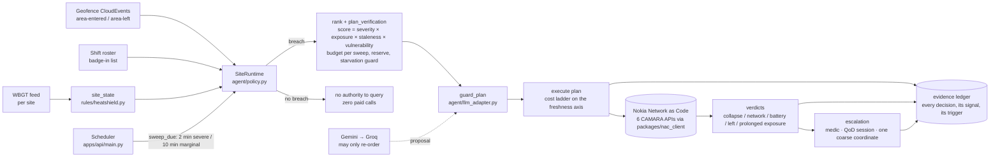

# HeatShield — Architecture

**One sentence.** The mobile network is the sensor: a geofence subscription per worker delivers presence for free, and
only while a legal heat threshold is breached does the agent earn the authority to spend paid queries — ranked, budgeted,
and written to an evidence ledger that is itself the product.

This document describes what runs in this repository today. Anything on the roadmap is labelled as such.

## 1. The loop

Two layers, and the order between them is the design:

| Layer | Where | What it does | What it cannot do |
|---|---|---|---|
| **Rules** | `packages/rules/heatshield.py`, `config.py` | Pure functions: threshold and ban-hours per jurisdiction, exposure score, budget allocation, cost ladder, verdict classification | Nothing side-effectful — no I/O, no clock |
| **Agent** | `packages/agent/policy.py` | State machine per site and per worker; executes the plan against the operator; liveness probe; roster reconciliation; ledger; escalation | Invent a query outside a breach |
| **Model (optional)** | `packages/agent/llm_adapter.py` | Proposes a **permutation** of the plan the rules produced, with a rationale per worker | Add, drop or repeat a worker; choose an API; exceed the budget; touch a verdict |
| **Operator client** | `packages/nac_client` | Single entry point for the six CAMARA APIs: auth, timeout, retry, circuit breaker, phone masking; `fixture` / `simulator` / `live` backends | — |
| **API + console** | `apps/api/main.py`, `apps/web/` | FastAPI service, scheduler, webhook sink, six one-click demo scenarios, the console | — |

## 2. States

**Site:** `passive_watch` → `alert` (marginal breach, 10-minute sweeps) → `emergency` (severe breach, 2-minute sweeps) →
back to `passive_watch` when the breach ends (`site_cleared`: open cases are closed as *unresolved*, never as *safe*).

**Worker:** `inside` (geofence entry or roster prior) → `confirming` (a verification is planned) → `verified_inside` /
`cleared` (exit event or verified outside) / `distress` (silent inside a breached zone) → `escalated` (medic dispatched).
A stale exit is a silent failure mode, so about a tenth of every sweep's budget is reserved to re-check presumed-safe
workers.

## 3. The verification budget (the hard part)

A 400-worker site under a breach cannot be polled exhaustively. Per sweep the agent holds a fixed number of paid queries
and allocates them in four moves:

1. **Spend nothing until you must.** Below the legal threshold there is no authority to query; presence is built from
   free geofence events only. This is enforced in code (`policy.step`), not in a policy document.
2. **Rank, then spend from the top.** `score = severity × exposure_minutes × staleness × vulnerability`. First-week
   workers, prior heat incidents and night-to-day shift changes raise vulnerability. The budget is spent down the list and
   the sweep stops when the budget ends, not when the list does — the report names who could not be reached.
3. **Climb the cost ladder only when the cheap signal is ambiguous.** The ladder runs on the *freshness* axis, which is
   where the operator's cost sits: geofence push (free) → Location Verification with a loose `maxAge` (cached, cheap) →
   Location Verification with a strict `maxAge` (forces a fresh fix, expensive) → Location Retrieval (a coordinate, once,
   after escalation — justified by privacy, not cost).
4. **Nobody waits forever.** A worker not yet queried in this breach outranks anyone already checked. Found by measurement:
   without it, 80 % of a 400-worker site was never queried once in a two-hour breach.

Measured on this code: a 400-worker sweep takes 47 ms and 20 000 workers fit in 90 MB — CPU and memory are not the
limit; the budget policy is. Full coverage holds to about **110 workers per site** at 20 queries per sweep on a
two-minute cadence. Larger sites are sub-sites with their own budgets.

## 4. Collapse, or a dead battery?

An unreachable device usually means a flat battery, a coverage hole or a switched-off phone. Escalating every one of them
produces alarm fatigue and gets the system switched off within a week. `classify_unreachable` separates the cases with
evidence already on hand:

| Test | Signal | Verdict it supports |
|---|---|---|
| Cluster | several devices in one micro-zone dark together + Congestion Insights `High` | network event — nobody is woken, a slice is requested *(slicing is `# MOCK`, roadmap)* |
| Device history | a silence window that repeats daily | dead battery — supervisor informed |
| Trajectory | last verified position moving toward the exit | left the site — logged only |
| Continuity | online for hours, then dark, stationary, at peak WBGT | **probable collapse** — medic, QoD session, one coordinate |
| Liveness probe | a strict-freshness location query forces the network to page the device; if it answers, it is alive | overrules a stale reachability reading |
| Prolonged exposure | device answering, worker inside for more than 45 minutes of breach | prolonged exposure — supervisor check |

Only the surviving case reaches a human. Every verdict carries `explain[]`: signal, value, weight, source, and whether it
fired.

## 5. The scheduler — the agent's own clock

`apps/api/main.py::Scheduler` re-sweeps breached sites on their own cadence (2 minutes severe, 10 minutes marginal)
without anyone calling the API. Every ledger row records its `trigger`: `scheduler`, `api` or `demo`. It is **off by
default in fixture mode** so that the six demo scenarios replay identically every time — the public demo instance runs
that way — and on in `simulator` and `live` mode (`HS_SCHEDULER=1` forces it). Nine tests cover the cadence, the
lifespan start/stop and the trigger stamping.

## 6. Roster reconciliation and the liveness probe

The event stream is not the single source of truth. Every fifteen minutes the agent reconciles the shift roster with the
geofence picture: a badged-in worker with no network event enters the queue with a presence prior of 0.5, and a device
that never appeared is reported as a data-quality task for the morning, not a blind spot in the afternoon. The coverage
metric (`site.coverage()`) counts only workers the network has actually seen — reconciliation cannot inflate it.

The liveness probe rejects `UNKNOWN` and future-dated answers, and an open escalation is never closed by a late answer.
An earlier version accepted both and silently cancelled every collapse verdict in an eight-hour test; the fix is in the
tests.

## 7. Jurisdiction is a configuration entry

`packages/rules/config.py` ships Qatar (WBGT > 32.1 °C year-round plus the 10:00–15:30 summer ban), Saudi Arabia and the
UAE (midday bans). Only Qatar publishes a numeric WBGT limit; the other two carry the Qatari figure as a stated
placeholder. `HS_JURISDICTION=SA` switches the whole rule set; the *Three jurisdictions* demo runs all three on the same
minute and the same temperature.

## 8. Privacy and legal basis, in code

- No breach → no query. Enforced.
- The default query returns a verdict, not a coordinate. A coordinate is requested once, after escalation, and is
  coarsened to three decimals before it enters the ledger.
- The ledger *is* a per-worker presence record — bounded (`ledger_max_entries`), counted (`presence_record()`), and every
  stored coordinate names the escalation that justified it. We do not claim "no location history"; an audit showed that
  claim was false and the console now shows the measured count.
- Phone numbers are masked at the client boundary; secrets are redacted from every debug view.

## 9. Resilience

Circuit breaker per API in `nac_client`; when it opens, no worker is marked safe — the ledger writes *unknown* and the
worker stays in the queue (*Nokia API down* demo). Answers from untrusted sources are counted as unknown. The model chain
is Gemini → Groq → rules; a timeout, a 429, malformed JSON or a guard violation all fall back to the deterministic order,
and the ledger records which hop answered.

## 10. Deliberately not built (and said so)

Durable storage, authentication and multi-tenancy on `/v1/*`, per-site locking, a circuit breaker keyed by (API, site),
geofence subscription deletion at end of employment, consent as an enforced precondition. Each is listed with its cost in
the pitch deck's "road to production" slide and in the Idea Capture §9C. Network Slicing is a separate Nokia product and
is marked `# MOCK` wherever it appears.
